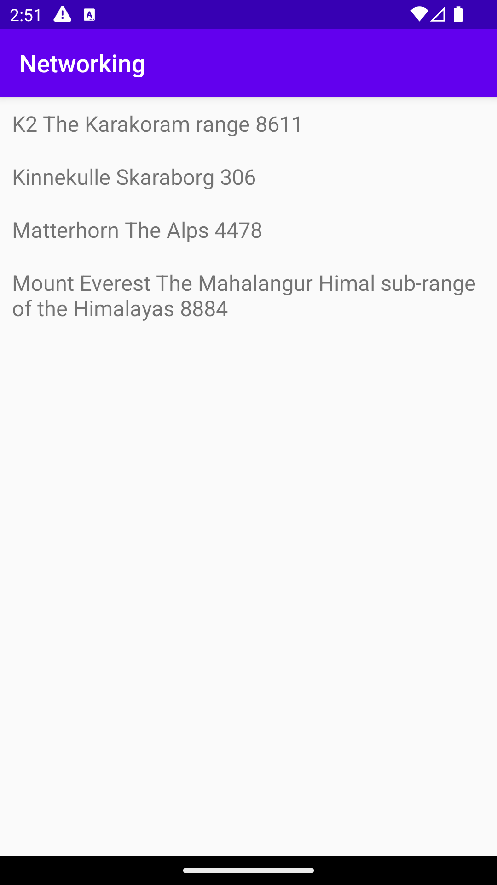

# Rapport

Först skapades en recyclerview-widget i activity_main för att placera de textview-items från activity_item
där bergens information uppdateras. Activity_main.xml anropas i en onCreate-metod i MainActivity.java för 
att starta recyclerview när appen startas. Sedan så anropas activity_item.xml i en onPostExucute i MainActivity 
där där också den apadter för att hantera json som görs om till gson och placerar datan fårn Mountain.java 
i en Arraylist. 
```
    @Override
    public void onPostExecute(String json) {
        Log.d("MainActivity", json);

        Gson gson = new Gson();
        Type type = new TypeToken<List<Mountain>>() {}.getType();

        ArrayList<Mountain> listOfBerg = gson.fromJson(json, type);

        myAdapter = new RecyclerViewAdapter(this, listOfBerg);

        RecyclerView view = findViewById(R.id.recycler_view);
        view.setLayoutManager(new LinearLayoutManager(this));
        view.setAdapter(myAdapter);

        myAdapter.notifyDataSetChanged();
    }
```
Det skapades en java-klass för de items som ska presenteras i recyclerview sm döptes till Mountain.java.
Där angavs det som ville presenteras i strängen som sedan ska skrivas ut. Innan det så behövs en konstruktor 
skapas för att kunna få access till det som finns i Mountain-klassen då dessa är private. 
```
public class Mountain {

    private String name;
    private String location;
    private int size;


    public Mountain(String name, String location, int  height) {

        this.name = name;
        this.location = location;
        this.size = size;
    }

    @Override
    public String toString() {
        String output= name+" "+location+" "+size;
        return output;
    }
}
```


